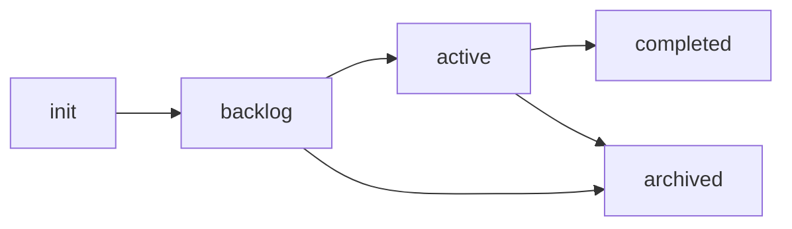

# dfspec move

Move a feature to a different status.

## Synopsis

```bash
dfspec move <feature> <status> [flags]
```

## Description

Moves a feature between status directories (`active`, `backlog`, `completed`, `archived`). Updates both the directory structure and the `roadmap.json`.

## Arguments

| Argument | Required | Description |
|----------|----------|-------------|
| `feature` | Yes | Feature name |
| `status` | Yes | Target status: `active`, `backlog`, `completed`, `archived` |

## Examples

### Move to Active

```bash
dfspec move user-authentication active
```

Output:

```
Moved 'user-authentication' from backlog/ to active/

Feature is now active. Next steps:
  1. Create/update PRD: specs/active/user-authentication/prd.json
  2. Implement the feature
  3. Run 'dfspec move user-authentication completed' when done
```

### Move to Completed

```bash
dfspec move user-authentication completed
```

Output:

```
Moved 'user-authentication' from active/ to completed/

Feature completed. Don't forget to:
  1. Update release notes
  2. Update CHANGELOG
```

### Archive a Feature

```bash
dfspec move old-feature archived
```

Output:

```
Moved 'old-feature' from backlog/ to archived/

Feature archived.
```

## Typical Flow



1. `dfspec init feature` → Creates in `backlog/`
2. `dfspec move feature active` → Ready to implement
3. `dfspec move feature completed` → Shipped
4. (or) `dfspec move feature archived` → Cancelled

## Roadmap Updates

When moving a feature, `roadmap.json` is automatically updated:

Before:
```json
{
  "backlog": [
    {"feature": "user-authentication", "priority": 1}
  ],
  "active": []
}
```

After `dfspec move user-authentication active`:
```json
{
  "backlog": [],
  "active": [
    {"feature": "user-authentication", "priority": 1, "started_at": "2025-01-15T10:00:00Z"}
  ]
}
```
