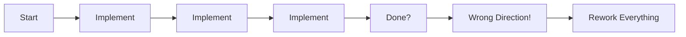
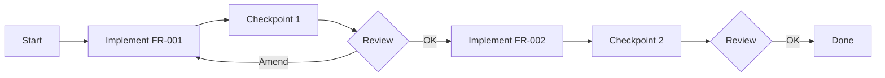

# Checkpoints

Checkpoints are defined pause points during execution where the system stops to validate progress, surface discoveries, and allow human review.

## Purpose

Checkpoints:

- Create natural validation gates during implementation
- Allow mid-execution course correction
- Surface unexpected discoveries
- Enable human review before proceeding
- Support partial completion states

## The Problem They Solve

Without checkpoints, autonomous execution has these failure modes:



With checkpoints:



## Structure

Checkpoints are defined in the PRD:

```json
{
  "checkpoints": [
    {
      "id": "CP-001",
      "name": "Core Auth Complete",
      "after_requirements": ["FR-001", "FR-002"],
      "validation_type": "human_review",
      "pause_on_discovery": true,
      "description": "Review authentication before proceeding to authorization"
    },
    {
      "id": "CP-002",
      "name": "Authorization Complete",
      "after_requirements": ["FR-003", "FR-004"],
      "validation_type": "automated",
      "validation_criteria": [
        "All unit tests pass",
        "Integration tests pass",
        "Coverage > 80%"
      ]
    }
  ]
}
```

## Fields

| Field | Required | Description |
|-------|----------|-------------|
| `id` | Yes | Unique identifier (CP-XXX) |
| `name` | Yes | Human-readable name |
| `after_requirements` | Yes | Requirements that trigger this checkpoint |
| `validation_type` | Yes | How to validate (see below) |
| `pause_on_discovery` | No | Stop if new requirements emerge |
| `description` | No | Additional context |
| `validation_criteria` | No | For automated validation |

## Validation Types

### Human Review

Requires human approval to proceed:

```json
{
  "validation_type": "human_review",
  "description": "Review auth implementation before proceeding"
}
```

When reached:

1. Execution pauses
2. Progress report is generated
3. Human reviews implementation
4. Human approves, requests changes, or amends spec
5. Execution resumes

### Automated

Uses automated checks:

```json
{
  "validation_type": "automated",
  "validation_criteria": [
    "All unit tests pass",
    "No lint errors",
    "Coverage > 80%"
  ]
}
```

When reached:

1. Automated checks run
2. If all pass, execution continues
3. If any fail, execution pauses for human review

### Skip

No validation (informational only):

```json
{
  "validation_type": "skip"
}
```

## Linking Requirements to Checkpoints

Requirements reference their checkpoint:

```json
{
  "functional_requirements": [
    {
      "id": "FR-001",
      "description": "User registration",
      "checkpoint": "CP-001"
    },
    {
      "id": "FR-002",
      "description": "User login",
      "checkpoint": "CP-001"
    },
    {
      "id": "FR-003",
      "description": "Role assignment",
      "checkpoint": "CP-002"
    }
  ]
}
```

## Discoveries

When implementation reveals unknowns, they're captured:

```json
{
  "discoveries": [
    {
      "id": "D-001",
      "checkpoint": "CP-001",
      "discovered_at": "2025-01-15T14:30:00Z",
      "description": "Email uniqueness check needs case-insensitive comparison",
      "impact": "Affects FR-001 acceptance criteria",
      "resolution": "Added to FR-001: emails normalized to lowercase",
      "resolved_at": "2025-01-15T15:00:00Z",
      "resolved_by": "Engineer"
    }
  ]
}
```

## Execution Reports

At each checkpoint, a report is generated:

```json
{
  "checkpoint_id": "CP-001",
  "reached_at": "2025-01-15T14:30:00Z",
  "completion": {
    "implemented": 2,
    "blocked": 0,
    "pending": 3
  },
  "requirement_status": [
    {"id": "FR-001", "status": "implemented"},
    {"id": "FR-002", "status": "implemented"}
  ],
  "discoveries": [
    {
      "id": "D-001",
      "description": "Email case sensitivity issue",
      "severity": "medium"
    }
  ],
  "tests": {
    "passed": 15,
    "failed": 0,
    "skipped": 2
  },
  "notes": "Ready for review. One discovery needs discussion."
}
```

## Pause on Discovery

When `pause_on_discovery: true`, execution stops if:

- New requirements are discovered
- Existing requirements need modification
- Blocking issues emerge
- High-uncertainty items need resolution

```json
{
  "id": "CP-001",
  "pause_on_discovery": true
}
```

This prevents AI from making assumptions about ambiguous situations.

## Best Practices

1. **Place strategically** - After logical groupings of requirements
2. **Use human review for uncertainty** - Don't let AI guess
3. **Keep checkpoints small** - Review 2-5 requirements, not 20
4. **Capture discoveries** - Document what you learn
5. **Include validation criteria** - Make "done" unambiguous
6. **Plan for amendments** - Specs will change during implementation

## Example: Complete Flow

```json
{
  "functional_requirements": [
    {
      "id": "FR-001",
      "description": "User registration",
      "checkpoint": "CP-001",
      "status": "pending"
    },
    {
      "id": "FR-002",
      "description": "User login",
      "checkpoint": "CP-001",
      "status": "pending"
    },
    {
      "id": "FR-003",
      "description": "Password reset",
      "checkpoint": "CP-002",
      "status": "pending"
    }
  ],
  "checkpoints": [
    {
      "id": "CP-001",
      "name": "Core Auth",
      "after_requirements": ["FR-001", "FR-002"],
      "validation_type": "human_review",
      "pause_on_discovery": true
    },
    {
      "id": "CP-002",
      "name": "Auth Complete",
      "after_requirements": ["FR-003"],
      "validation_type": "automated",
      "validation_criteria": ["All tests pass", "Coverage > 80%"]
    }
  ]
}
```
