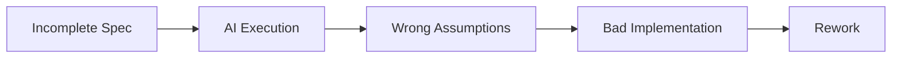
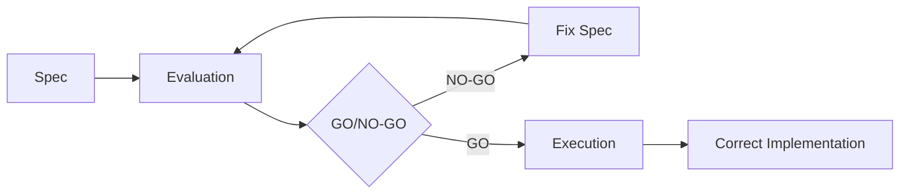

# Evaluation

Evaluation provides GO/NO-GO gating before execution begins. It assesses spec completeness and quality.

## Purpose

Evaluation:

- Validates spec completeness before execution
- Identifies gaps and ambiguities
- Provides structured findings with severity
- Makes GO/NO-GO recommendations
- Supports multi-judge aggregation

## The Problem It Solves

Bad specs lead to bad implementations:



With evaluation:



## Structure

```json
{
  "metadata": {
    "evaluation_id": "EVAL-2025-001",
    "evaluated_at": "2025-01-15T10:00:00Z",
    "evaluator": "spec-guide-reviewer",
    "rubric_version": "1.0.0"
  },
  "subject": {
    "type": "prd",
    "id": "PRD-2025-001",
    "version": "1.0.0",
    "title": "User Authentication"
  },
  "categories": [ ... ],
  "findings": [ ... ],
  "summary": { ... },
  "decision": { ... }
}
```

## Category Scores

Each category is scored 0-10:

```json
{
  "categories": [
    {
      "category": "problem_definition",
      "weight": 0.15,
      "score": 9.0,
      "rationale": "Clear problem statement with quantified impact"
    },
    {
      "category": "requirements_clarity",
      "weight": 0.25,
      "score": 7.5,
      "rationale": "Most requirements clear, some edge cases missing"
    },
    {
      "category": "acceptance_criteria",
      "weight": 0.25,
      "score": 8.0,
      "rationale": "Good coverage, testable criteria"
    },
    {
      "category": "constraints",
      "weight": 0.10,
      "score": 8.5,
      "rationale": "Constraints well documented"
    },
    {
      "category": "non_goals",
      "weight": 0.10,
      "score": 9.0,
      "rationale": "Clear scope boundaries"
    },
    {
      "category": "uncertainty_handling",
      "weight": 0.15,
      "score": 6.0,
      "rationale": "Some high-uncertainty items lack discovery prompts"
    }
  ]
}
```

Categories:

| Category | Weight | What It Evaluates |
|----------|--------|-------------------|
| `problem_definition` | 0.15 | Clear problem, impact, desired state |
| `requirements_clarity` | 0.25 | Unambiguous, implementable requirements |
| `acceptance_criteria` | 0.25 | Testable, complete criteria |
| `constraints` | 0.10 | Documented limitations |
| `non_goals` | 0.10 | Explicit scope boundaries |
| `uncertainty_handling` | 0.15 | Flagged unknowns, discovery prompts |

## Findings

Specific issues with severity:

```json
{
  "findings": [
    {
      "id": "F-001",
      "severity": "high",
      "category": "acceptance_criteria",
      "title": "Missing error response format",
      "description": "FR-001 doesn't specify error response structure for validation failures",
      "location": "functional_requirements[0].acceptance_criteria",
      "suggestion": "Add: 'Returns {errors: [{field, message}]} on validation failure'",
      "blocking": true
    },
    {
      "id": "F-002",
      "severity": "medium",
      "category": "uncertainty_handling",
      "title": "High uncertainty without discovery prompt",
      "description": "FR-003 has high uncertainty but no discovery_prompt",
      "location": "functional_requirements[2]",
      "suggestion": "Add discovery_prompt to clarify concurrency behavior",
      "blocking": false
    }
  ]
}
```

Severity levels:

| Severity | Blocking | Action |
|----------|----------|--------|
| `critical` | Yes | Must fix before proceeding |
| `high` | Yes | Must fix before proceeding |
| `medium` | No | Should fix, triggers human review |
| `low` | No | Can fix later |
| `info` | No | Informational only |

## Summary

Overall assessment:

```json
{
  "summary": {
    "overall_score": 7.8,
    "strengths": [
      "Clear problem definition with business impact",
      "Well-defined target users",
      "Explicit non-goals prevent scope creep"
    ],
    "weaknesses": [
      "Some edge cases missing from acceptance criteria",
      "High-uncertainty items need more guidance"
    ],
    "finding_counts": {
      "critical": 0,
      "high": 1,
      "medium": 2,
      "low": 1,
      "info": 0
    }
  }
}
```

## Decision

GO/NO-GO recommendation:

```json
{
  "decision": {
    "type": "conditional",
    "rationale": "Spec mostly complete but has one high-severity gap",
    "conditions": [
      "Address F-001 (error response format)"
    ],
    "requires_human_review": true,
    "human_review_reason": "Medium-severity findings need human judgment"
  }
}
```

Decision types:

| Type | Meaning |
|------|---------|
| `go` | Approved for execution |
| `no_go` | Not approved, must fix issues |
| `conditional` | Approved with conditions |

## Pass Criteria

Configurable thresholds:

```json
{
  "pass_criteria": {
    "min_score": 7.5,
    "max_critical": 0,
    "max_high": 0,
    "max_medium": -1,
    "human_review_required": ["medium findings present"]
  }
}
```

| Criteria | Default | Meaning |
|----------|---------|---------|
| `min_score` | 7.0 | Minimum overall score |
| `max_critical` | 0 | Maximum critical findings |
| `max_high` | 0 | Maximum high findings |
| `max_medium` | -1 | Maximum medium findings (-1 = unlimited) |

## Multi-Judge Aggregation

For critical specs, use multiple judges:

```json
{
  "metadata": {
    "judge_runs": [
      {
        "judge_id": "judge-1",
        "model_id": "claude-3-opus",
        "temperature": 0.0,
        "decision": "go",
        "executed_at": "2025-01-15T10:00:00Z"
      },
      {
        "judge_id": "judge-2",
        "model_id": "claude-3-opus",
        "temperature": 0.3,
        "decision": "conditional",
        "executed_at": "2025-01-15T10:01:00Z"
      }
    ]
  }
}
```

When judges disagree, human review is required.

## Human Review Triggers

Human review is required when:

- Any medium+ severity findings exist
- Judges disagree on decision
- Overall score is borderline (7.0-8.0)
- High-uncertainty requirements exist

## Best Practices

1. **Run evaluation early** - Don't wait until spec is "done"
2. **Address high/critical first** - These block progress
3. **Use multi-judge for critical specs** - Reduce bias
4. **Trust the process** - NO-GO exists for good reasons
5. **Iterate quickly** - Fix findings and re-evaluate
