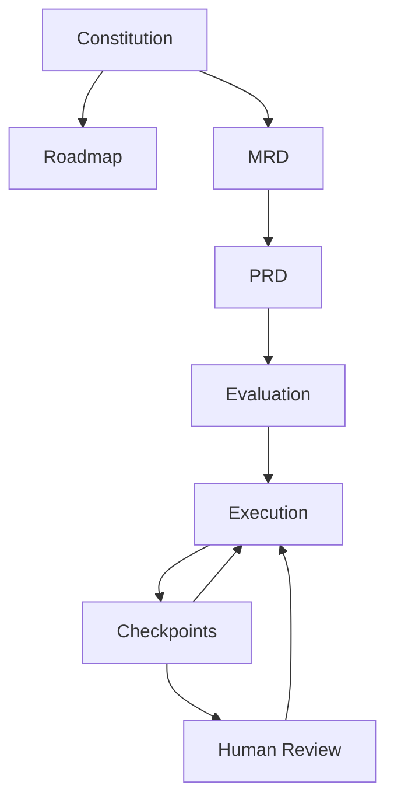
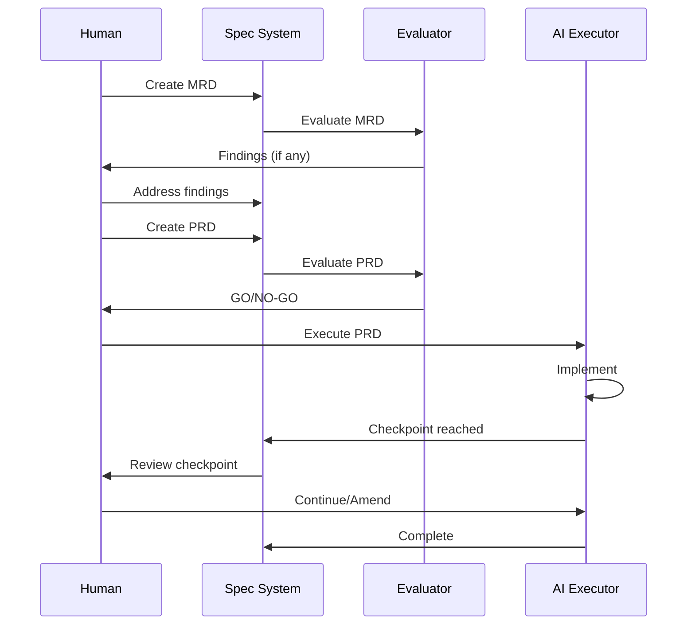

# Concepts Overview

Dark Factory is built around a hierarchy of specification documents that work together to enable autonomous AI development.

## Document Hierarchy



## Core Documents

### Constitution

The **Constitution** is the organization-wide source of truth. It defines:

- Approved technologies (languages, frameworks, databases)
- Architectural patterns and principles
- Quality and security standards
- File organization conventions
- Development processes

Individual specs inherit from the constitution and can override with justification.

[:octicons-arrow-right-24: Constitution Details](constitution.md)

### Roadmap

The **Roadmap** tracks all features by status:

- **Active** - Currently being implemented
- **Backlog** - Planned, prioritized by importance
- **Completed** - Shipped and released
- **Archived** - Cancelled or superseded

[:octicons-arrow-right-24: Roadmap Details](roadmap.md)

### MRD (Market Requirements Document)

The **MRD** captures high-level business requirements:

- Problem statement (what's wrong, what should be)
- Target users (personas, needs, pain points)
- Success metrics (how we measure success)
- High-level requirements (must-have, should-have, etc.)
- Constraints and non-goals

[:octicons-arrow-right-24: MRD Details](mrd.md)

### PRD (Product Requirements Document)

The **PRD** details technical implementation requirements:

- Functional requirements with acceptance criteria
- Non-functional requirements (performance, security)
- Test hints for comprehensive coverage
- Checkpoint references for validation gates
- Uncertainty markers for unknowns

[:octicons-arrow-right-24: PRD Details](prd.md)

## Key Concepts

### Checkpoints

Checkpoints are defined pause points during execution where:

- Progress is reported
- Discoveries are surfaced
- Human review can occur
- Spec amendments can be made

[:octicons-arrow-right-24: Checkpoints Details](checkpoints.md)

### Uncertainty Markers

Requirements can explicitly flag uncertainty:

```json
{
  "id": "FR-003",
  "description": "Handle concurrent uploads",
  "uncertainty": "high",
  "uncertainty_reason": "Concurrency model not specified",
  "discovery_prompt": "What happens when two users upload simultaneously?"
}
```

This forces explicit acknowledgment of unknowns rather than hoping AI figures it out.

### Evaluation

Before execution begins, specs are evaluated for completeness:

- Category scores (problem definition, requirements, etc.)
- Findings (critical, high, medium, low, info)
- GO/NO-GO decision

[:octicons-arrow-right-24: Evaluation Details](evaluation.md)

## Workflow



## Go-First Schema Approach

Dark Factory uses a **Go-first** approach to schema management:

1. Go structs are the source of truth (`types/*.go`)
2. JSON schemas are generated from Go types
3. Examples are validated against schemas
4. Changes flow: Go → JSON Schema → Validation

This ensures type safety and makes it easy to work with specs in Go code.
