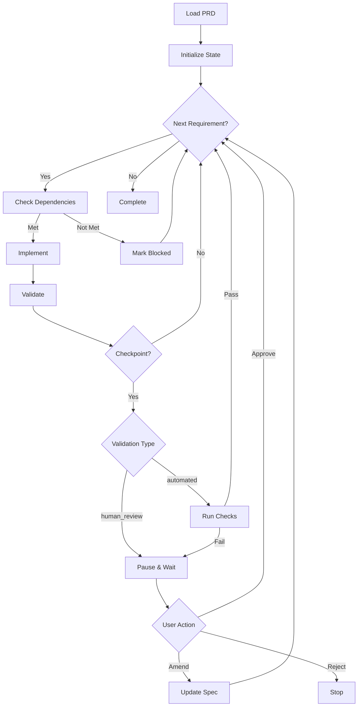

# dfspec-exec Skill

The `/dfspec-exec` skill executes approved PRD specifications autonomously with checkpoint-based human oversight.

## Installation

```bash
make install-skill-dfspec-exec
# or
make install-skill  # installs both skills
```

## Usage

```
/dfspec-exec user-authentication
```

### Options

```
/dfspec-exec user-authentication --resume   # Resume paused execution
/dfspec-exec user-authentication --status   # Check status only
```

## How It Works



## Execution State

State is persisted to `specs/active/{feature}/execution.json`:

```json
{
  "prd_reference": "PRD-2025-001",
  "feature": "user-authentication",
  "status": "in_progress",
  "current_requirement": "FR-002",
  "requirement_states": [
    {
      "requirement_id": "FR-001",
      "status": "implemented",
      "started_at": "2025-01-15T10:00:00Z",
      "completed_at": "2025-01-15T11:00:00Z"
    }
  ],
  "checkpoint_states": [
    {
      "checkpoint_id": "CP-001",
      "status": "pending"
    }
  ]
}
```

## Checkpoints

### Human Review

When validation type is `human_review`:

1. Execution pauses
2. Progress report generated
3. User reviews and chooses:
   - **Approve** - Continue execution
   - **Amend** - Modify spec, then continue
   - **Reject** - Stop execution

### Automated

When validation type is `automated`:

1. Run validation criteria (tests, lint, etc.)
2. If all pass: continue automatically
3. If any fail: pause for human review

## Discovery Handling

When unexpected issues arise:

| Severity | Action |
|----------|--------|
| Critical | Pause immediately |
| High | Pause at next checkpoint |
| Medium | Continue, flag for review |
| Low | Note in report |

Discoveries are recorded:

```json
{
  "id": "D-001",
  "type": "edge_case",
  "description": "Email case sensitivity",
  "severity": "medium",
  "suggested_action": "Normalize to lowercase"
}
```

## CLI Integration

```bash
# Check status
dfspec execute status user-authentication

# List checkpoints
dfspec checkpoint list user-authentication

# Approve checkpoint
dfspec checkpoint approve user-authentication CP-001

# View log
dfspec execute log user-authentication
```

## Example Session

```
User: /dfspec-exec user-authentication

Claude: Loading PRD for user-authentication...

Execution Plan:
  1. FR-001: User registration
  2. FR-002: User login
  → CP-001: Core Auth (human_review)
  3. FR-003: Password reset

Starting execution...

━━━━━━━━━━━━━━━━━━━━━━━━━━━━━━
FR-001: User registration
━━━━━━━━━━━━━━━━━━━━━━━━━━━━━━

[Implements registration endpoint]

✓ FR-001 complete (5 tests passing)

━━━━━━━━━━━━━━━━━━━━━━━━━━━━━━
FR-002: User login
━━━━━━━━━━━━━━━━━━━━━━━━━━━━━━

[Implements login endpoint]

✓ FR-002 complete (8 tests passing)

━━━━━━━━━━━━━━━━━━━━━━━━━━━━━━
CHECKPOINT: CP-001
━━━━━━━━━━━━━━━━━━━━━━━━━━━━━━

Requirements: 2/5 complete
Tests: 13 passing
Discoveries: 1

[Shows checkpoint report]

Approve to continue?

User: Approve

Claude: ✓ Checkpoint approved. Continuing...
```

## Files

```
skills/dfspec-exec/
├── SKILL.md
├── agents/
│   ├── implementer.md    # Implements requirements
│   ├── validator.md      # Runs validations
│   └── reporter.md       # Generates reports
└── references/
    ├── implementation-guide.md
    └── checkpoint-template.md
```
