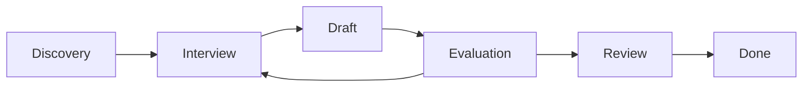

# dfspec-guide Skill

The `/dfspec-guide` Claude skill guides users through creating complete MRD/PRD documents.

## Installation

```bash
# From the repo directory
make install-skill
```

This creates a symlink at `~/.claude/skills/dfspec-guide`.

## Usage

In Claude Code:

```
/dfspec-guide
```

## Workflow

The skill guides you through 5 phases:



### Phase 1: Discovery

Determines:

- Spec type (MRD vs PRD)
- High-level context
- Existing documentation

### Phase 2: Structured Interview

Walks through each required section:

- Asks probing questions
- Flags uncertainty and edge cases
- Collects answers in structured format

### Phase 3: Draft Generation

Generates:

- JSON spec (canonical)
- Validates against schema

### Phase 4: Evaluation

Runs structured evaluation:

- Category scores
- Findings with severity
- GO/NO-GO decision

If NO-GO, returns to Phase 2 to address gaps.

### Phase 5: Human Review Gate

Presents:

- Evaluation report
- Requires explicit approval

## Probing Questions

The skill asks questions to ensure completeness:

### Problem Statement

- What specific problem are you solving?
- What's the business impact of this problem?
- How do users currently work around this?

### Target Users

- Who are the primary users?
- What are their main pain points?
- Are there secondary user personas?

### Requirements

- What must be true for this to be considered complete?
- What are the edge cases?
- What happens when things go wrong?

### Constraints

- What technical limitations exist?
- Are there timeline constraints?
- What regulatory requirements apply?

### Non-Goals

- What is explicitly out of scope?
- What might people assume is included but isn't?

## Completeness Rubric

The skill evaluates against:

| Criterion | Weight | Description |
|-----------|--------|-------------|
| Problem clarity | 15% | Clear, specific problem statement |
| User definition | 15% | Well-defined personas with needs |
| Requirements | 25% | Specific, implementable requirements |
| Acceptance criteria | 20% | Testable success criteria |
| Constraints | 10% | Documented limitations |
| Non-goals | 10% | Explicit scope boundaries |
| Uncertainty handling | 5% | Flagged unknowns |

## Pass Criteria

| Criterion | Threshold |
|-----------|-----------|
| Minimum score | 7.5/10 |
| Max critical findings | 0 |
| Max high findings | 0 |
| Max medium findings | Unlimited (triggers review) |

## Example Session

```
You: /dfspec-guide

Claude: I'll help you create a complete specification document.

First, some questions:
1. What are you building? (Feature, product, etc.)
2. Do you have an existing MRD, or are we starting fresh?

You: Building user authentication. Starting fresh.

Claude: Great! Let's create an MRD for user authentication.

**Problem Statement**
What specific problem does this solve? What happens today without it?

You: Users can't access protected resources. Everything is public.

Claude: What's the business impact?

You: We can't monetize or personalize anything.

Claude: Perfect. Let me capture that...

[continues through all sections]

Claude: Here's your draft MRD:
[shows JSON]

Running evaluation...

✓ Score: 8.2/10
✓ No blocking findings
→ Ready for approval

Do you approve this spec for implementation?
```

## Configuration

The skill reads from constitution.json for:

- Tech stack constraints
- File organization standards
- Quality thresholds

## Files

```
~/.claude/skills/dfspec-guide/
├── SKILL.md                    # Main skill definition
├── references/
│   ├── mrd-template.md         # MRD guidance
│   ├── prd-template.md         # PRD guidance
│   ├── section-questions.md    # Probing questions
│   └── completeness-rubric.md  # Evaluation criteria
└── agents/
    ├── interviewer.md          # Question agent
    ├── reviewer.md             # Evaluation agent
    └── rewriter.md             # Improvement agent
```
